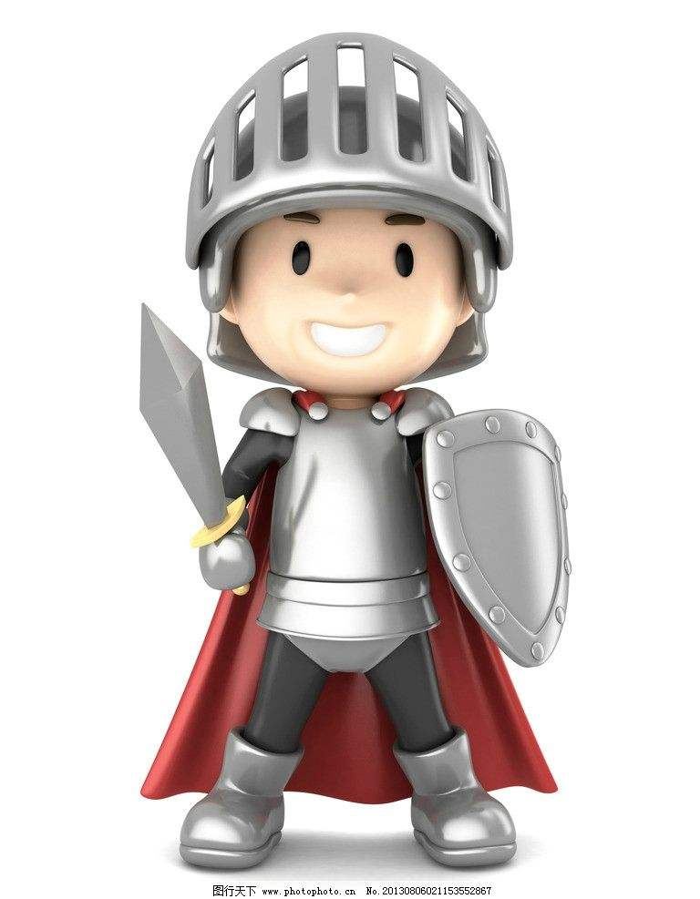
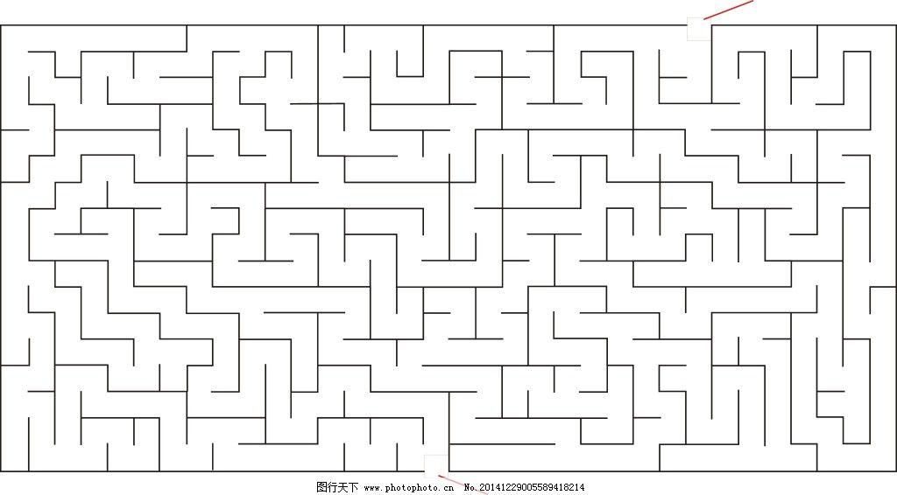

#第二个html游戏博客
##游戏策划
Setting: 角色为一个贪婪的勇者，在夺取宝物之后想离开险恶之地。 
但在离开的陆上，他遇到了一个墙上布满陷阱的迷宫，一碰就死。 
 
Gameplay:结合电流急急棒与迷宫的玩法，鼠标控制角色，若触碰迷宫墙壁则死亡。 

ps. 勇者的hitbox只有一个小点，迷宫的hitbox是可视的黑线。

##游戏设计
Object: 勇者
Attribute:,位于玩家鼠标指向处
Collaborator：迷宫 Events & Actions: 按住左键控制 & 碰到迷宫销毁自己

Object: 迷宫
Attribute:,位于底图层
Collaborator：勇者 Events & Actions: 与勇者接触时销毁勇者
 