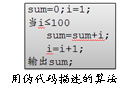

#自顶而下的编程方法
##自顶而下的编程
    伪代码、<br/>NS图、<br/>流程图都是自顶而下的一种编程方法。<br/>
    这种将一复杂问题分割成很多小块的编程方法对我们学习编程有非常大的帮助。
    以下便是一个简单的例子

##洗衣机控制程序
```
1. 电源启动
2. 让用户选择洗衣类型(ABCD)
3. 根据用户选择的类型执行相应的洗衣程序
4. 结束洗衣时提醒用户
