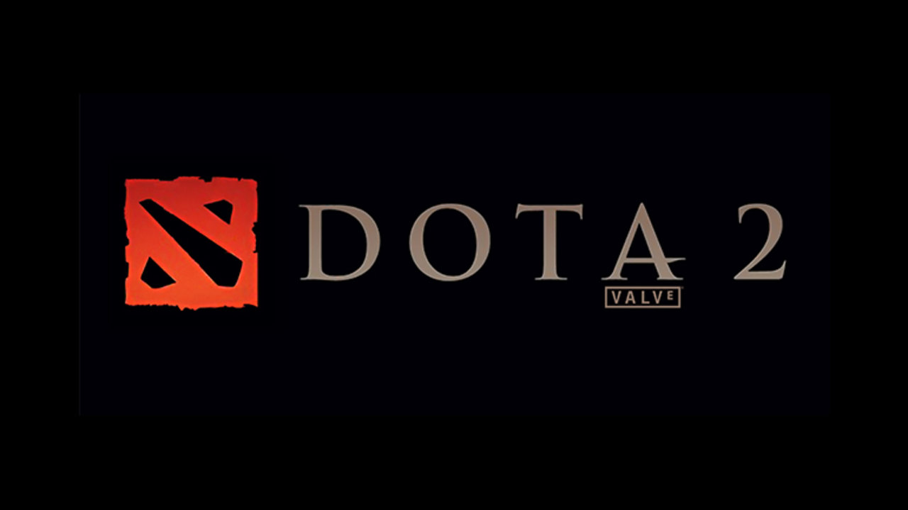
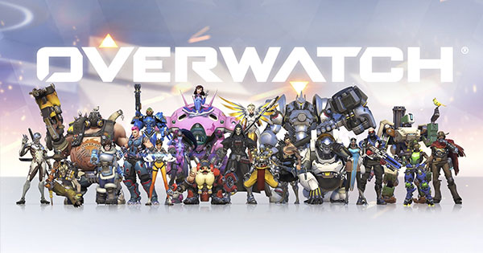
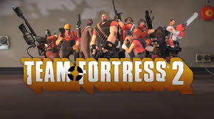

# 游戏玩法抄袭到底算不算抄袭?
## 例子

首先，来看看在6-7年前充满争议的案例，dota与LOL两个主流moba游戏的抄袭界定。 
 
 

在更早之前，dota本来是基于暴雪公司旗下的Warcraft3的地图编辑器起家的一个热门地图。在制作dota2时，因暴雪享有dota的完整版权(基于Warcraft3地图编辑器的条款)，许多角色、技能等等都必须与dota做出区分。就是因为dota2历经了这么多的困难，LOL当时以一个新秀的身份加入了MOBA(推塔)类游戏的斗争之中，是令人瞩目的。 
当时，游戏产业进入了过渡期，尚未完全发展，与游戏相关的产业活动也仅仅是存在而已。在所有人对版权不是那么熟悉的情况下，才会有这起争议。在今日，这两个游戏除了玩法同属MOBA外，已经是两个完全不一样的游戏，也没人在讨论lol是否抄袭dota了。 

再来，是两年前同属暴雪的一个新游戏overwatch 

 
两者拥有一样的玩法，类似于结合了MOBA类的FPS(第一人称射击)游戏，甚至在某些角色上的技能等等有相似之处。当然，与LOL不同的是，OW是在一个对游戏环境较为友好的时代产出的。这些对OW的不利言论也仅仅止步于留言的阶段。在OW实际推出后，所有关于抄袭的留言也都销声匿迹。这两个游戏从立绘、玩法、等等，都有着本质上的区别。 

而什么样的游戏才真正的因抄袭而被告呢? 这里举刀塔传奇为例 
 
这款由上海莉莉丝公司推出的手游，在玩法方面与dota没有半毛钱的关系，但由于使用了与dota角色相似的外形(几乎一模一样)，而被暴雪公司起诉(最后结果为双方和解)。

## 总结
1. 玩法抄袭是否是抄袭还得看实际状况 
    基本上玩法抄袭并不属于抄袭，多数游戏公司只是在同类别的游戏下制作属于自己的游戏，代码、美工、剧本，等等的都能表示出两种游戏的区别。

2. 在外形上抄袭的属于抄袭 
    大多被告抄袭的原因都是美术设计图抄袭，游戏的代码、玩法等方面，都难以界定为抄袭行为。
